### General information

This is a curved folding model with a single crease.
The parameters of the curved fold are optimized to fit the surface to the 3D target points. 

Relateted papers: 
- Yuka Watanabe, Jun Mitani, "Modelling the Folding Motions of a Curved Fold", in Origami7: Proceedings of the 7th International Meeting on Origami in Science, Oxford, England, September 5-7, 2018, pages 1135-1150.
- Yuka Watanabe, Jun Mitani, "Fitting Single Crease Curved-Fold Model to the User Specified Points", Computer-Aided Design & Applications, 19(2), 2022, 387-404. 
 "Intuitive User Interface for a Single Crease Model Manipulation" (Section 4.1 and Figure 2)

The source code and sample data for the other sections of the papers are provided in other branches: 
- "Stitch the Boundaries of Two Surface Patches" (Section 4.2 and Figure 5) : "MultiPieces2". 
https://github.com/yukakohno/CurvedFold/tree/MultiPieces2
- "Evaluation" (Section 5) : "EvaluateOptimization". 
https://github.com/yukakohno/CurvedFold/tree/EvaluateOptimization

This code is build by Visual Studio 2019 with libraries below installed. 
- openCV 2.4.9
- fltk-1.3.5
- freeglut 3.0.0 MSVC Package (https://www.transmissionzero.co.uk/software/freeglut-devel/)

### How to use

###### 1. Load Curve Parameters (P.txt) 

[load] button -> choose P.txt 

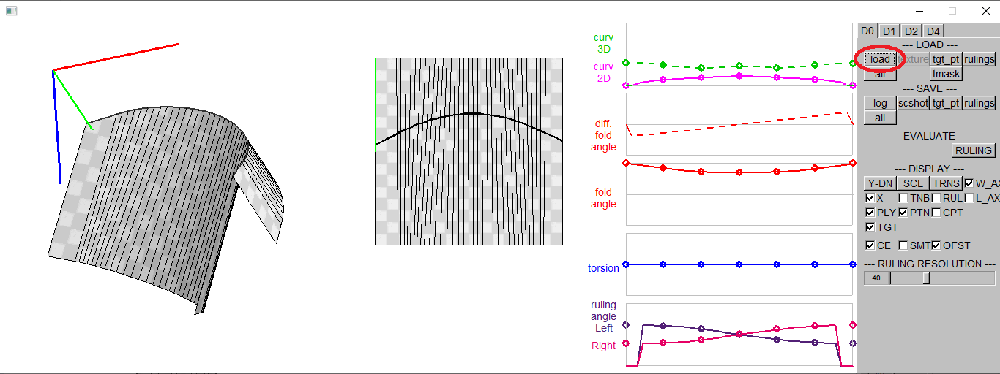 

###### 2. Load Target Points (target*.txt) 

[tgt_pt] button -> choose target*.txt 

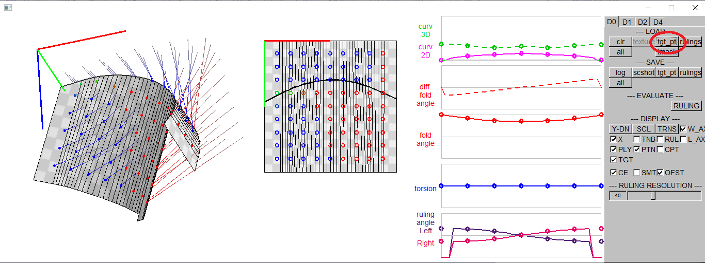 

3D target points and the corresponding points on the curved fold are loaded.
The color shows the distance between 2D and 3D points.
Red/blue indicates larger distance and green for smaller distance.

###### 3. Load Target Mask (tmask*.txt) (optional)

[tmask] button -> choose tmask*.txt 

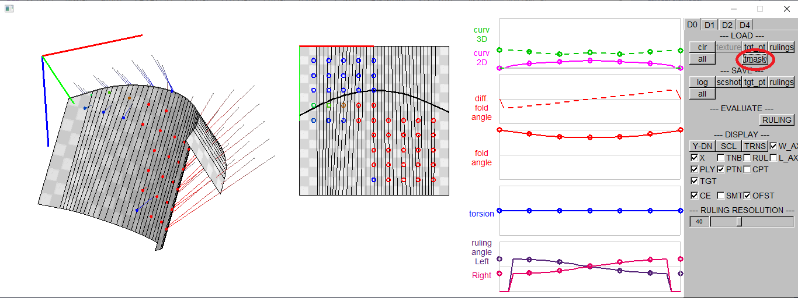

Target points on mask=0 are deleted.

###### 4. Load Rulings (ruling*.txt) (optional)

[ruling] button -> choose ruling*.txt 

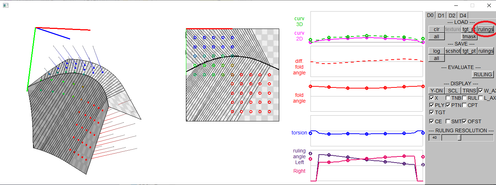

Rulings are loaded.

###### 5. Switch Rulings (optional)

The rulings may be switched by [switch] button on [D4] tab.

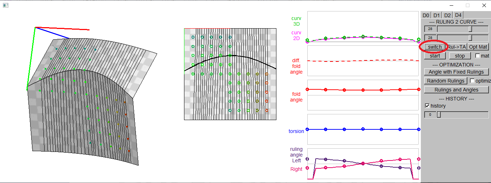 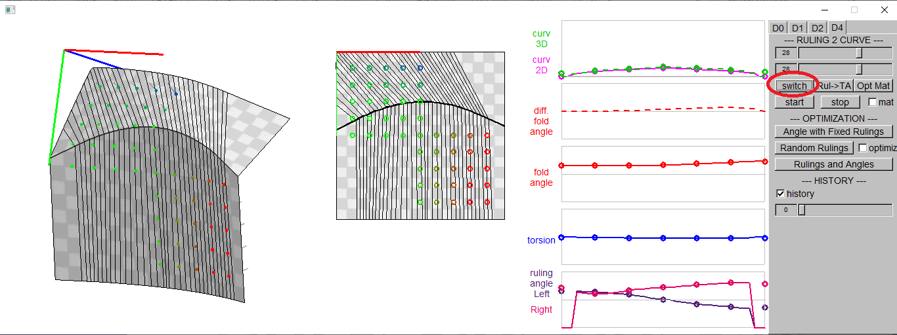
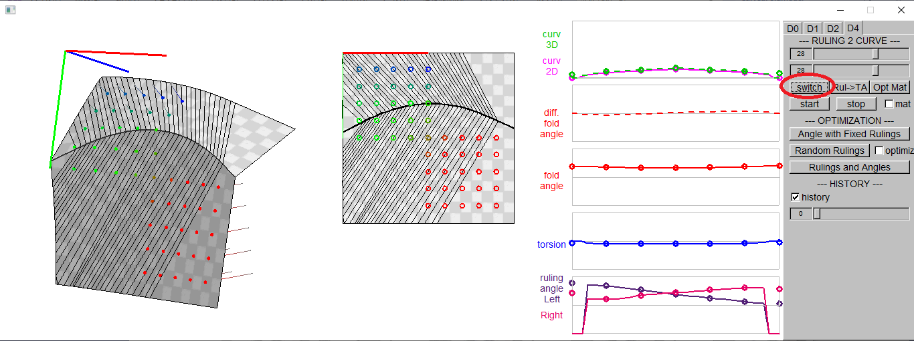 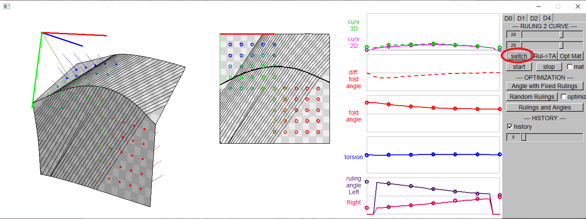
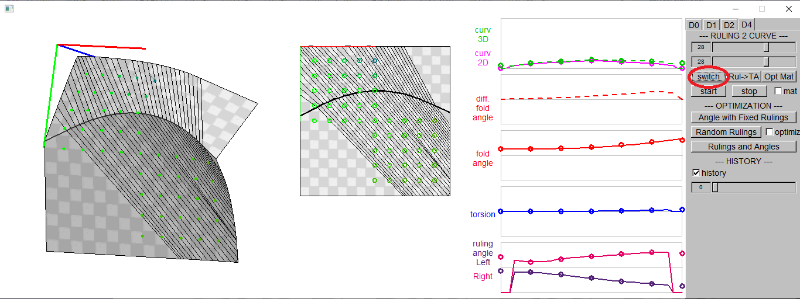 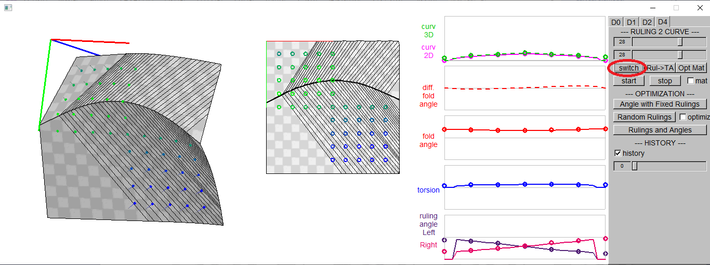
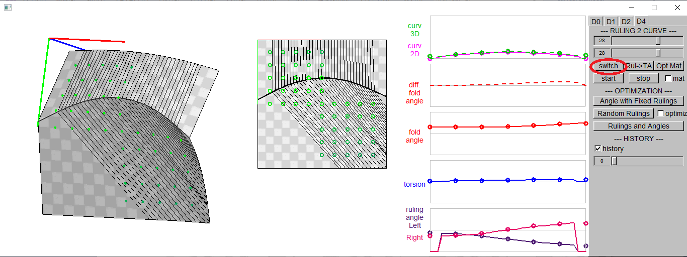

###### 6. Start/Stop Folding Animation (w/wo pose optimization)

The folding motion starts/stops by [Start][Stop] buttons.
The folding angle is increased or decreased with fixed rulings.
If you check the checkbox [mat], the pose is set to minimize the total distance to the target points, or the distances between the target points and the corresponding points on the curved fold.

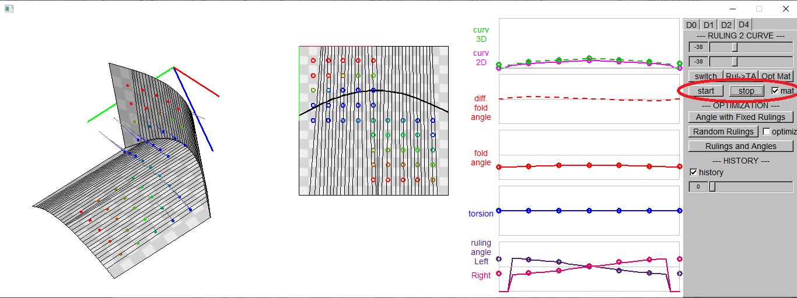
<!--img src="readme_images/10_start_stop_01.bmp" height="35%">  

###### 7. Optimize Folding Angle with Fixed Rulings

[Angle with Fixed Rulings] button sets the folding angle to minimize the total distance to the target points.

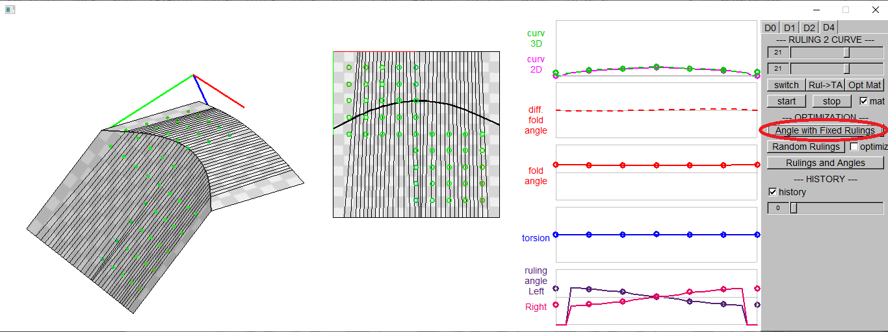

###### 8. Random Rulings

[Random Rulings] button makes a small changes int the rulings.
If the the checkbox [optimze] is checked, the rulings change is accepted only if the total distance to the target points are decreased by the change.

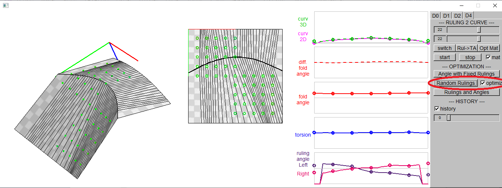
<!--img src="readme_images/12_Random_Rulings_01.bmp" width="75%"-->
<!--img src="readme_images/12_Random_Rulings_02.bmp" width="75%"-->

###### 9. Optimize Rulings and Angles

[Rulings and Angles] button optimizes the rulings and the folding angles to minimized the distance to the target points, so that the curved folded surface approximates the target points.

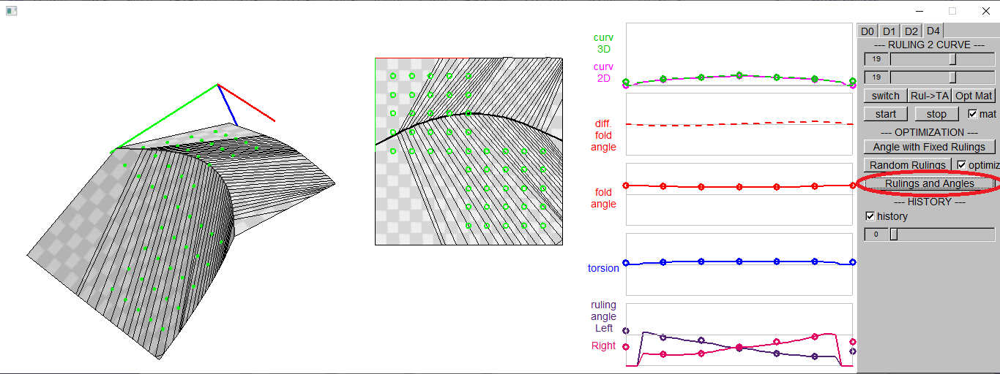
