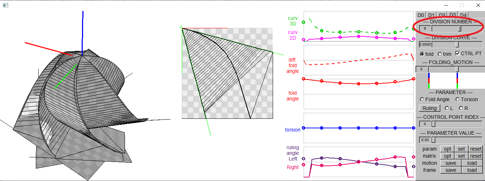
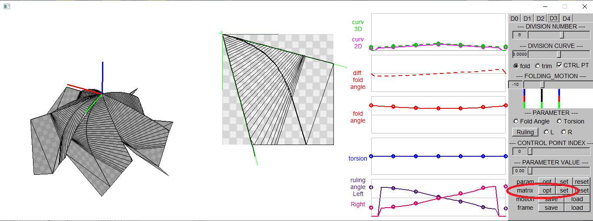

### General information

This is a software to model and design a curved folding model with a single crease and a "rotationally symmetric curved folding" composed of mutiple pieces with single creases.
The parameters of the curved fold are optimized to fit the surface to the 3D target points. 

This code is build by Visual Studio 2019 with libraries below installed. 
- openCV 2.4.9
- fltk-1.3.5
- freeglut 3.0.0 MSVC Package (https://www.transmissionzero.co.uk/software/freeglut-devel/)

For the basic information of this software, please refer to: 
Yuka Watanabe, Jun Mitani, "Modelling the Folding Motions of a Curved Fold", in Origami7: Proceedings of the 7th International Meeting on Origami in Science, Oxford, England, September 5-7, 2018, pages 1135-1150. 
Yuka Watanabe, Jun Mitani, "Visualization of Folding Motion of Rotationally Symmetric Curved Folding", Computer-Aided Design & Applications, 17(3), 2019, 513-524. 

### How to optimize the parameters

#### Curved folding with a single crease

See readme.md in branch "SingleCrease2."

#### Curved folding with multiple pieces with single creases

###### 1. Load Curve Parameters (P.txt) 

[load] button -> choose P1.txt 
Adjust rotation, scale, translation of the 3D object.

 

###### 2. Make multiple pieces  

Choose DIVISION NUMBER in [D3] tab to dupulicate the 3D object and to make "rotationally symmetric curved folding."

 

###### 3. Choose an intermediate frame  

Choose an intermediate frame by choosing a number between 0 and -20 of the value slider FOLDING MOTION.

 

###### 4. Optimize the pose of the piece. 

Optimize and set the pose of the pieces by
 [opt] button -> [set] button -> [opt] button in matrix row. 

 

Below DISPLAY in [D0] tab, 
Check the checkbox [ONE] to show one piece with texture and others as wire frame models. 
Check the checkbox [stch] to show the pairs of boundary points "stitched" and their mid points.

 

###### 5. Set target points  

Set the mid points of the pairs of boundary points as the target points by
 [opt] button in param row. 
Target point are shown in blue and the original points, or the boundary points on one side, is shown in red.

 

###### 6. Optimize the parameters, the torsions and the folding angles 

On [D4] tab, check the checkbox [rot] and press [Rulings and Angles] button. 
If the optimization process does not start, press [Random Rulings] button beforehand. 
In the optimization process, the torsions and the folding angels of the curved crease are optimized to minimize the total distances between the target points and the original points.

 

###### 7. Set the optimized parameters  

Go back to [D3] tab and set the optimized parameters by [set] button in param row. 

 

###### 8. Check the result  

Check the result.  Repeat step 4-7 if necessary. 

 
