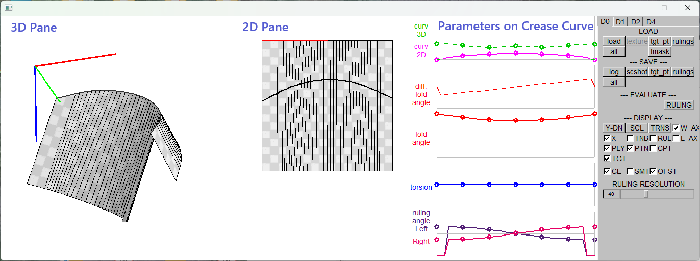
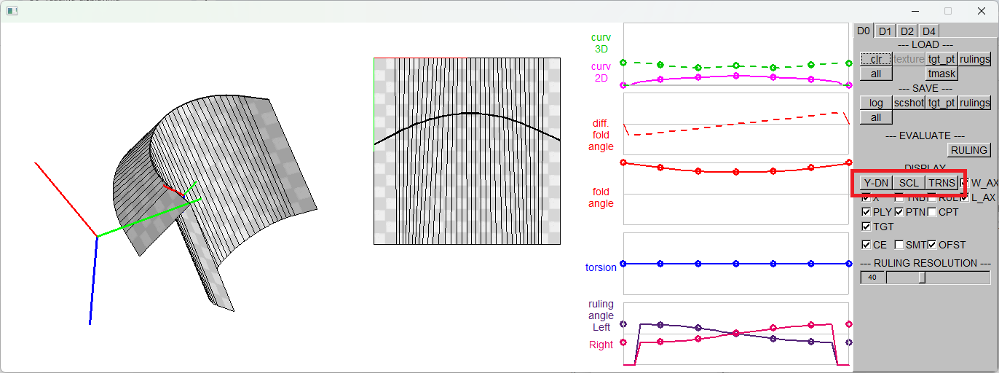
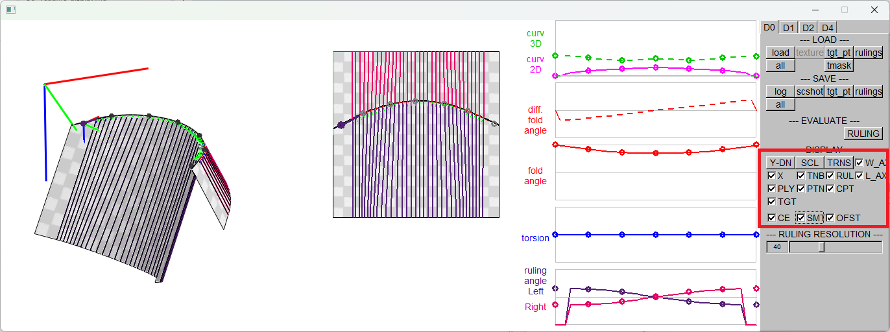

How to use the GUI interface

### 1. Display Options

#### 1.1. General Infomation 

The GUI is composed of 3 panes and a contol panel. 
The 3 panes are
- 3D Pane (LEFT): the polygon model in 3D space
- 2D Pane (CENTER): the curved crease and the rulings in 2D space
- Parameter Graphs (RIGHT): graphs of the parameters/angles along the crease curve

 

#### 1.2. Changing the Camera Pose 

To change/reset the camera pose in the 3D Pane,
- Rotation : shift + left mouse drag
- Scale : alt + left mouse drag
- Translation : ctrl + left mouse drag
- Reset Rotation (swith pose) : button[Y-DN/Z-UP/X-UP]
- Reset Scale : button[SCL]
- Reset Translation : button[TRNS]

 

#### 1.3. Showing/Hiding Each Elements 

To show/hide the elements of the 2D/3D model, check the checkbuttons under "DISPLAY" section:
- X : Crease curve
- TNB : Tangent, normal, and binormal vectors of the curved crease
- RUL : Rulings
- W_AX : XYZ-Axis of the world coordinate system
- L_AX : XYZ-Axis of the object coordinate system
- PLY : Polygon model
- PTN : Pattern/texture on the model
- CPT : Control points on the curved crease
- TGT : Target points for fitting the model
- CE : This checkbox is not for display option. Keep this checked.
- SMT : Smoothness option in 3D rendering
- OFST : Line offset option in 3D rendering

 

