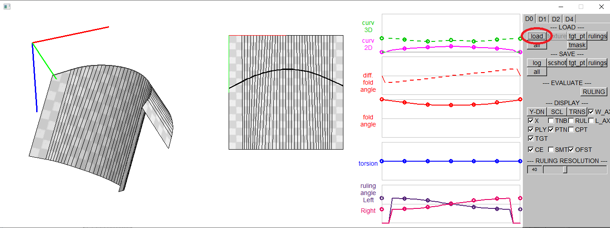
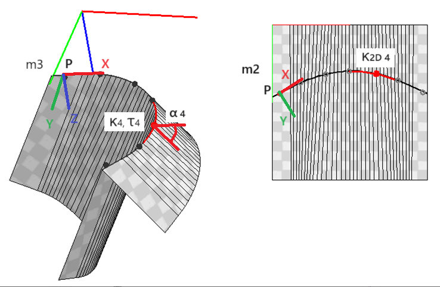

How to use the GUI interface

### 3. Fitting Curved Folded Model to the User Specified Points

#### 3.1. Load Curve Parameters (P.txt) 

[load] button -> choose P.txt 

 

All the input files are in "CurvedFold/GUI/input/". 
In P.txt, the folding angle and the 2D curvature of the control points on the 2D crease curve are defined on 3rd and 4th columns. 
m2m3.txt is automatically loaded with P.txt.  It describes the 3D and 2D poses of the starting point of the curved crease in the form of homogeneous coordinates.

| P.txt | m2m3.txt ||
| ---- | ---- | ---- |
| 10 1 # file type, mode: B, kv,tr,fa,k2d &nbsp; &nbsp; &nbsp;  7 # plot count 0.0 &nbsp; 0.0 &nbsp; &alpha;0 &nbsp; &kappa;2D 0 0.0 &nbsp; 0.0 &nbsp; &alpha;1 &nbsp; &kappa;2D 1 0.0 &nbsp; 0.0 &nbsp; &alpha;2 &nbsp; &kappa;2D 2 0.0 &nbsp; 0.0 &nbsp; &alpha;3 &nbsp; &kappa;2D 3 0.0 &nbsp; 0.0 &nbsp; &alpha;4 &nbsp; &kappa;2D 4 0.0 &nbsp; 0.0 &nbsp; &alpha;5 &nbsp; &kappa;2D 5 0.0 &nbsp; 0.0 &nbsp; &alpha;6 &nbsp; &kappa;2D 6 | m2 &nbsp; &nbsp; &nbsp; &nbsp; &nbsp; &nbsp; &nbsp; &nbsp; &nbsp; &nbsp; &nbsp; &nbsp; &nbsp; &nbsp; &nbsp; &nbsp; &nbsp; &nbsp; &nbsp; &nbsp;  Xx &nbsp; Xy &nbsp; 0.0 Yx &nbsp; Yy &nbsp; 0.0 Px &nbsp; Py &nbsp; 1.0 m3 Xx &nbsp; Xy &nbsp; Xz &nbsp; 0.0 Yx &nbsp; Yy &nbsp; Yz &nbsp; 0.0 Zx &nbsp; Zy &nbsp; Zz &nbsp; 0.0 Px &nbsp; Py &nbsp; Pz &nbsp; 1.0  |  |

#### 3.2. Load Target Points (target*.txt) 

Click [tgt_pt] button and choose target*.txt. 
3D target points and the corresponding points on the curved fold are loaded. 
The color shows the distance between 2D and 3D points. 
Red/blue indicates larger distance and green for smaller distance.

 

target*.txt includes pairs of 3D target point positions, 1st to 3rd columns, and 2D control point positions, the 4th and 5th columns.

| target*.txt |  |
| ---- | :----: |
| tp0x &nbsp; tp0y &nbsp; tp0z &nbsp; cp0x &nbsp; cp0y tp1x &nbsp; tp1y &nbsp; tp1z &nbsp; cp1x &nbsp; cp1y tp2x &nbsp; tp2y &nbsp; tp2z &nbsp; cp2x &nbsp; cp2y tp3x &nbsp; tp3y &nbsp; tp3z &nbsp; cp3x &nbsp; cp3y tp4x &nbsp; tp4y &nbsp; tp4z &nbsp; cp4x &nbsp; cp4y ... |  |

#### 3.3. Load Target Mask (tmask*.txt) (optional)

Click [tmask] button and choose tmask*.txt.  Target points on mask=0 are deleted.

| tmask*.txt  |
| ---- |
| 1 1 1 1 1 0 0 0 0  1 1 1 1 1 0 0 0 0  1 1 1 1 1 0 0 0 0  1 1 1 1 1 0 0 0 0  1 1 1 1 1 1 1 1 1  0 0 0 0 1 1 1 1 1  0 0 0 0 1 1 1 1 1  0 0 0 0 1 1 1 1 1  0 0 0 0 1 1 1 1 1  |

#### 3.4. Optimize the Shape and the Pose of the Curved Fold Model

Click [Rulings and Angles] button under "OPTIMIZATION" section on the tab [D4] 
The shape and the pose of the curved fold model is optimized to fit the target points.
 

