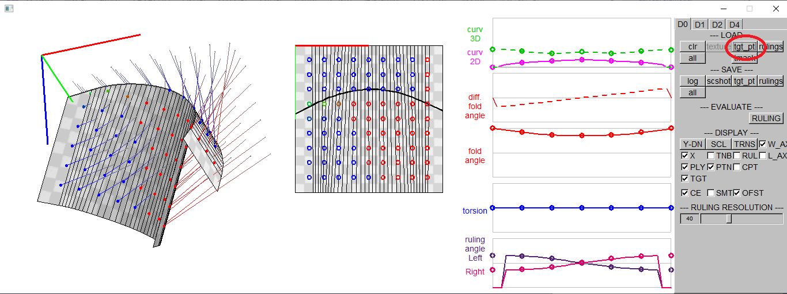
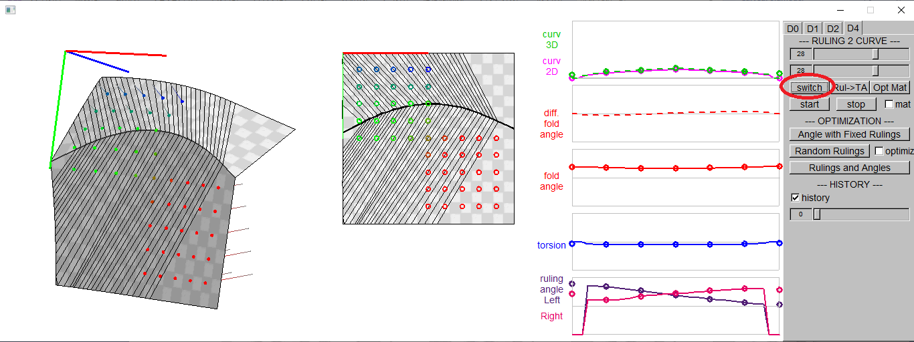
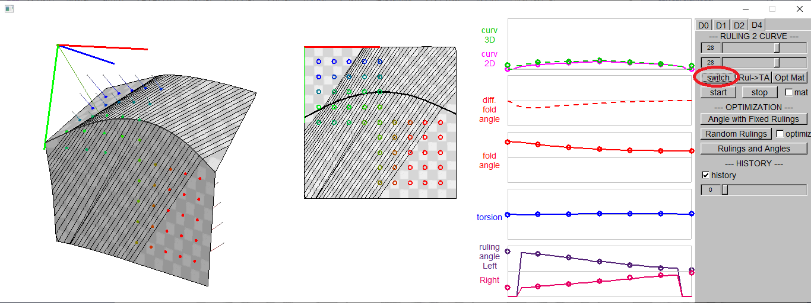
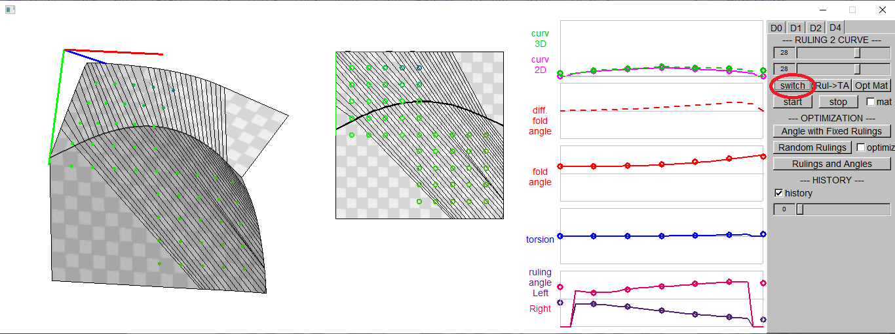
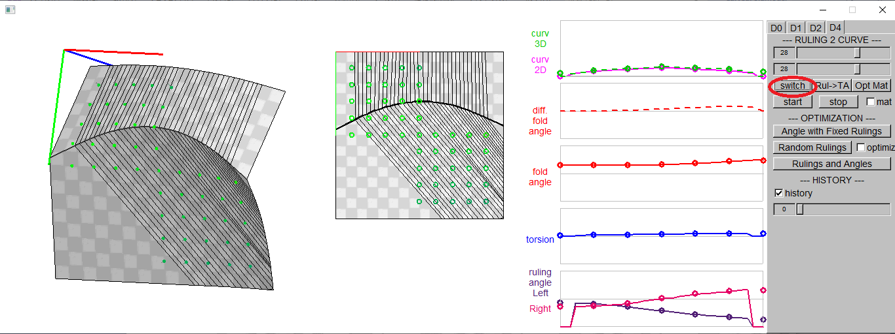
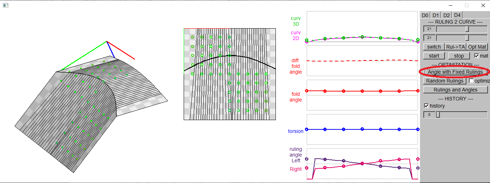

How to use the GUI interface

### 3. Fitting Curved Folded Model to the User Specified Points

#### 3.1. Load Curve Parameters (P.txt) 

[load] button -> choose P.txt 

 

All the input files are in "CurvedFold/GUI/input/". 
In P.txt, the folding angle and the 2D curvature of the control points on the 2D crease curve are defined on 3rd and 4th columns.

| P.txt |  |
| ---- | :----: |
| 10 1 # file type, mode: B, kv,tr,fa,k2d 7 # plot count 0.0 &nbsp; 0.0 &nbsp; &alpha;0 &nbsp; &kappa;2D 0 0.0 &nbsp; 0.0 &nbsp; &alpha;1 &nbsp; &kappa;2D 1 0.0 &nbsp; 0.0 &nbsp; &alpha;2 &nbsp; &kappa;2D 2 0.0 &nbsp; 0.0 &nbsp; &alpha;3 &nbsp; &kappa;2D 3 0.0 &nbsp; 0.0 &nbsp; &alpha;4 &nbsp; &kappa;2D 4 0.0 &nbsp; 0.0 &nbsp; &alpha;5 &nbsp; &kappa;2D 5 0.0 &nbsp; 0.0 &nbsp; &alpha;6 &nbsp; &kappa;2D 6 |  |

 

As P.txt is loaded, m2m3.txt is automatically loaded.  It describes the poses, in the form of homogeneous coordinates, of the starting point of the curved crease in the 2D paper and the 3D space.

| m2m3.txt |  |
| ---- | :----: |
| m2 &nbsp; &nbsp; &nbsp; &nbsp; &nbsp; &nbsp; &nbsp; &nbsp; &nbsp; &nbsp; &nbsp; &nbsp; &nbsp; &nbsp; &nbsp; &nbsp; &nbsp; &nbsp; &nbsp; &nbsp;  Xx &nbsp; Xy &nbsp; 0.0 Yx &nbsp; Yy &nbsp; 0.0 Px &nbsp; Py &nbsp; 1.0 m3 Xx &nbsp; Xy &nbsp; Xz &nbsp; 0.0 Yx &nbsp; Yy &nbsp; Yz &nbsp; 0.0 Zx &nbsp; Zy &nbsp; Zz &nbsp; 0.0 Px &nbsp; Py &nbsp; Pz &nbsp; 1.0  |  |

#### 3.2. Load Target Points (target*.txt) 

[tgt_pt] button -> choose target*.txt 

 

3D target points and the corresponding points on the curved fold are loaded.
The color shows the distance between 2D and 3D points.
Red/blue indicates larger distance and green for smaller distance.

target*.txt includes pairs of 3D target point positions, 1st to 3rd columns, and 2D control point positions, the 4th and 5th columns.

| target*.txt |  |
| ---- | :----: |
| tp0x &nbsp; tp0y &nbsp; tp0z &nbsp; cp0x &nbsp; cp0y tp1x &nbsp; tp1y &nbsp; tp1z &nbsp; cp1x &nbsp; cp1y tp2x &nbsp; tp2y &nbsp; tp2z &nbsp; cp2x &nbsp; cp2y tp3x &nbsp; tp3y &nbsp; tp3z &nbsp; cp3x &nbsp; cp3y tp4x &nbsp; tp4y &nbsp; tp4z &nbsp; cp4x &nbsp; cp4y ... |  |

#### 3.3. Load Target Mask (tmask*.txt) (optional)

[tmask] button -> choose tmask*.txt 

Target points on mask=0 are deleted.

> 1 1 1 1 1 0 0 0 0 
> 1 1 1 1 1 0 0 0 0 
> 1 1 1 1 1 0 0 0 0 
> 1 1 1 1 1 0 0 0 0 
> 1 1 1 1 1 1 1 1 1 
> 0 0 0 0 1 1 1 1 1 
> 0 0 0 0 1 1 1 1 1 
> 0 0 0 0 1 1 1 1 1 
> 0 0 0 0 1 1 1 1 1 

#### 3.4. Load Rulings (ruling*.txt) (optional)

[ruling] button -> choose ruling*.txt 

Rulings are loaded.

In ruling*.txt, the ruling angles of the control points on the left and the right sides of the 2D crease curve are defined.

> 2.022672	1.991598	1.849320	1.562967	1.298554	1.156659	1.127758 
> 1.118921	1.149995	1.292273	1.578625	1.843039	1.984934	2.013835 

#### 3.5. Switch Rulings (optional)

The rulings may be switched by [switch] button on [D4] tab.

 
 
 

#### 3.6. Start/Stop Folding Animation (w/wo pose optimization)

The folding motion starts/stops by [Start][Stop] buttons.
The folding angle is increased or decreased with fixed rulings.
If you check the checkbox [mat], the pose is set to minimize the total distance to the target points, or the distances between the target points and the corresponding points on the curved fold.

<!--img src="readme_images/10_start_stop_01.bmp" height="35%">  

#### 3.7. Optimize Folding Angle with Fixed Rulings

[Angle with Fixed Rulings] button sets the folding angle to minimize the total distance to the target points.

#### 3.8. Random Rulings

[Random Rulings] button makes a small changes int the rulings.
If the the checkbox [optimze] is checked, the rulings change is accepted only if the total distance to the target points are decreased by the change.

<!--img src="readme_images/12_Random_Rulings_01.bmp" width="75%"-->
<!--img src="readme_images/12_Random_Rulings_02.bmp" width="75%"-->

#### 3.9. Optimize Rulings and Angles

[Rulings and Angles] button optimizes the rulings and the folding angles to minimized the distance to the target points, so that the curved folded surface approximates the target points.

