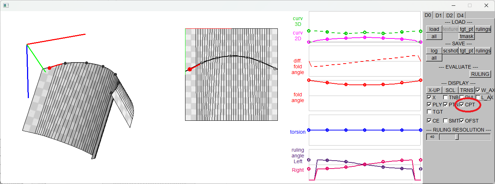
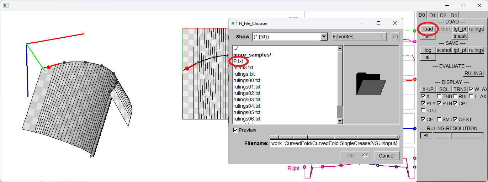
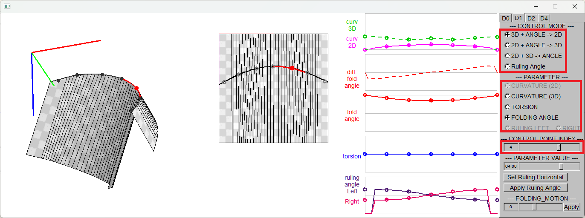
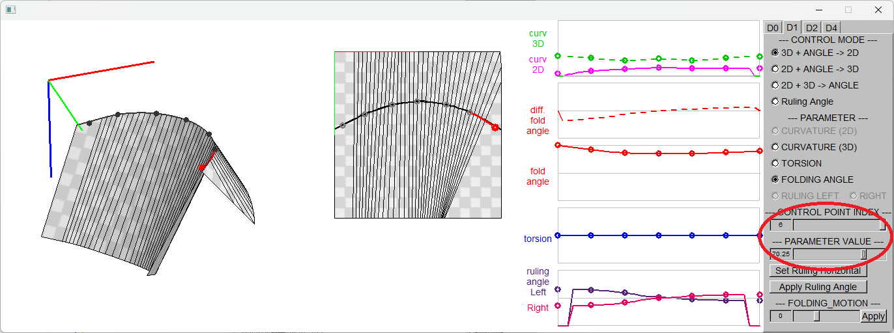
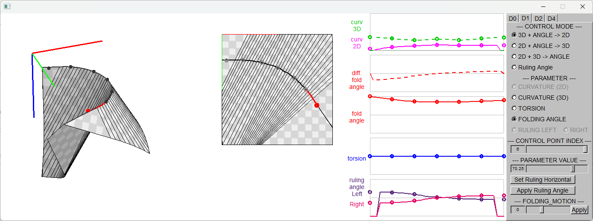
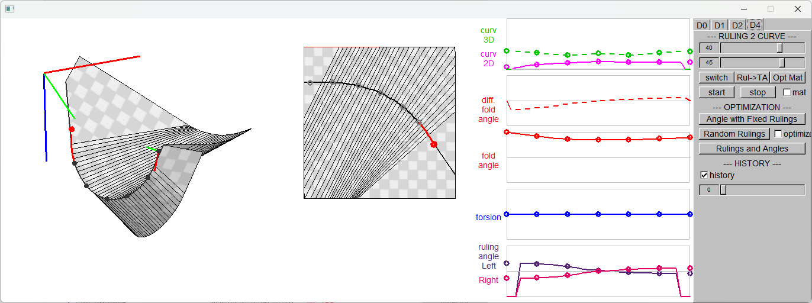
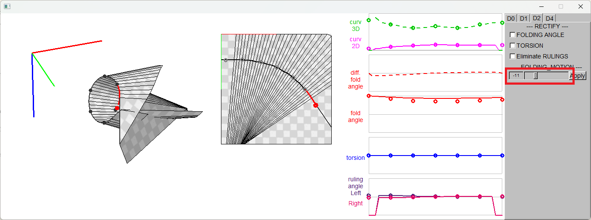
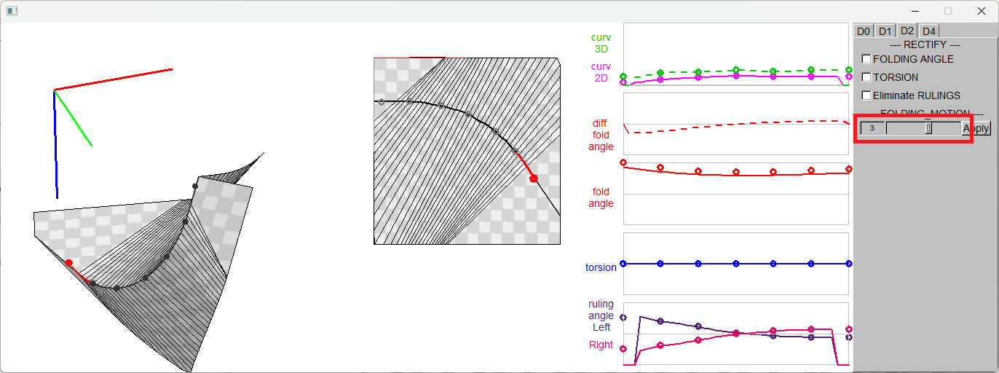
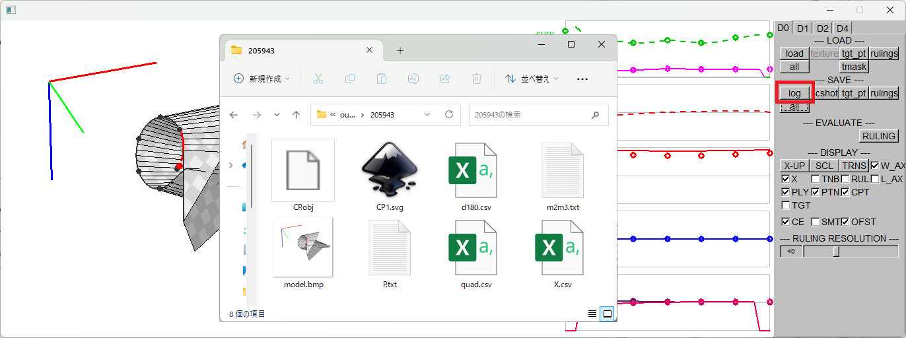

How to use the GUI interface

### 2. Modelling a Curved Folded Shapes and the Folding Motion

#### 2.1. Display Option Settings 
Check the checkbox[CPT] to show the control points on the crease curve.

 

#### 2.2. Load Initial Configuration 

Load "CurvedFold/GUI/input/P.txt". 
This step has been done when the software is launched. 
To reset the model shape, reload the same file.
 

#### 2.3. Choose the Control Mode, Parameter, and the Control Point to Modify the Parameter 

 

#### 2.4. Adjust the Parameter 

Choose the control point and change its parameter alternately to adjust the model shape as desired.
 

#### 2.5. Change the Position and the Angle of the 2D Crease Curve 
- Rotation: Left mouse drag on 2D pane.
- Translation: Right mouse drag on 2D pane.

 

#### 2.6. Change the Position and the Pose of the 3D Model 
- Rotation : shift + right mouse drag on 3D pane
- Translation : ctrl + right mouse drag on 3D pane

 

#### 2.7. Folding Motions 

 
 

#### 2.8. Export the Configuration 
By clicking on the button [log] under "SAVE" section, following files are saved in "CurvedFold/GUI/output/HHMMSS/*".
- CP.obj : 3D OBJ Polygon model
- CP1.svg : 2D Crease pattern + rulings
- P.txt, m2m3.txt : Input file of this software. 
- model.bmp : screenshot of 3D pane
- X.csv : parameters on the crease curve
- quad.csv, d180.csv : errors of the 3D model

 

P.txt contains the control mode and the curvature, the torsion, the folding angle, and the 2D curvature of the control points. 
m2m3.txt describes the 3D and 2D poses of the starting point of the curved crease, in the form of homogeneous coordinates.

| P.txt | m2m3.txt ||
| ---- | ---- | ---- |
| 10 1 # file type, mode: B, kv,tr,fa,k2d &nbsp; &nbsp; &nbsp;  7 # plot count &kappa;0 &nbsp; &tau;0 &nbsp; &alpha;0 &nbsp; &kappa;2D 0 &kappa;1 &nbsp; &tau;1 &nbsp; &alpha;1 &nbsp; &kappa;2D 1 &kappa;2 &nbsp; &tau;2 &nbsp; &alpha;2 &nbsp; &kappa;2D 2 &kappa;3 &nbsp; &tau;3 &nbsp; &alpha;3 &nbsp; &kappa;2D 3 &kappa;4 &nbsp; &tau;4 &nbsp; &alpha;4 &nbsp; &kappa;2D 4 &kappa;5 &nbsp; &tau;5 &nbsp; &alpha;5 &nbsp; &kappa;2D 5 &kappa;6 &nbsp; &tau;6 &nbsp; &alpha;6 &nbsp; &kappa;2D 6 | m2 &nbsp; &nbsp; &nbsp; &nbsp; &nbsp; &nbsp; &nbsp; &nbsp; &nbsp; &nbsp; &nbsp; &nbsp; &nbsp; &nbsp; &nbsp; &nbsp; &nbsp; &nbsp; &nbsp; &nbsp;  Xx &nbsp; Xy &nbsp; 0.0 Yx &nbsp; Yy &nbsp; 0.0 Px &nbsp; Py &nbsp; 1.0 m3 Xx &nbsp; Xy &nbsp; Xz &nbsp; 0.0 Yx &nbsp; Yy &nbsp; Yz &nbsp; 0.0 Zx &nbsp; Zy &nbsp; Zz &nbsp; 0.0 Px &nbsp; Py &nbsp; Pz &nbsp; 1.0  |  |
