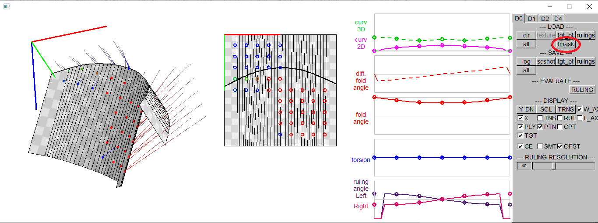
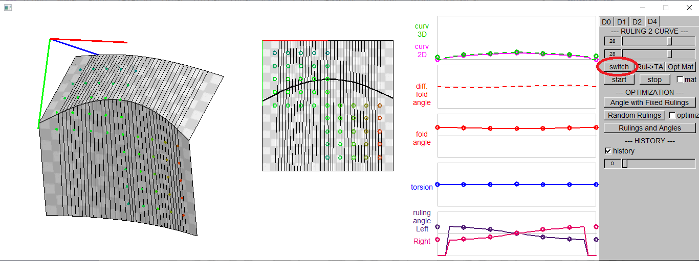
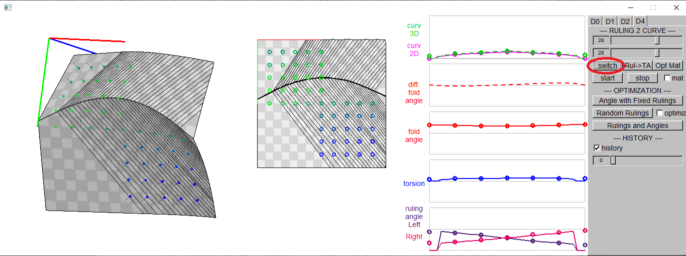
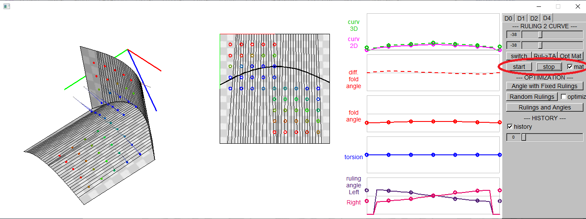
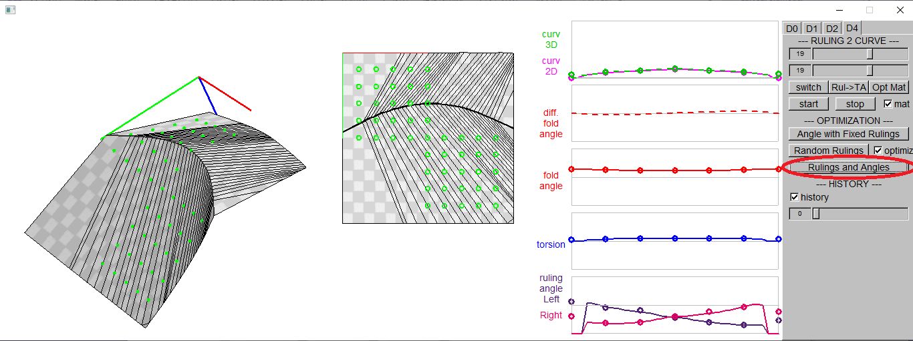

How to use the GUI interface

### 4. Folding Motion with Fixed Rulings

#### 4.1. Load Curve Parameters, Target Points, and Target Masks 

As in <a href="./readme_fitting.md">3. Fitting Curved Folded Model to the User Specified Points</a>, load input files. 
[load] button -> P.txt 
[tgt_pt] button -> target*.txt  
[tmask] button -> tmask*.txt 
The target points and the target mask are necessary for the pose optimization in 4.4, the folding angle optimizaion in 4.5, and for the pose and folding angle optimization in 4.7.

 

#### 4.2. Load Rulings (ruling*.txt)

Click [ruling] button and choose ruling*.txt. 
Rulings are loaded.

 

In ruling*.txt, the ruling angles of the control points on the left and the right sides of the 2D crease curve are defined.
| ruling*.txt  |
| ---- |
|2.022672 &nbsp; 1.991598 &nbsp; 1.849320 &nbsp; 1.562967 &nbsp; 1.298554 &nbsp; 1.156659 &nbsp; 1.127758 1.118921 &nbsp; 1.149995 &nbsp; 1.292273 &nbsp; 1.578625 &nbsp; 1.843039 &nbsp; 1.984934 &nbsp; 2.013835|

#### 4.3. Switch Rulings

Instead of loading a file, the rulings may be switched among the 7 pre-degined ruling configurations. 
Click [switch] button on [D4] tab.

 
 
 

#### 4.4. Start/Stop Folding Animation (w/wo pose optimization)

The folding motion starts/stops by [Start][Stop] buttons. 
The folding angle is increased or decreased with fixed rulings. 
If the checkbox [mat] is checked, the object pose is applied to minimize the total distance between the target points and the corresponding points on the curved surface.

<!--img src="readme_images/10_start_stop_01.bmp" height="35%">  

#### 4.5. Optimize Folding Angle with Fixed Rulings

[Angle with Fixed Rulings] button sets the folding angle to minimize the total distance to the target points.

#### 4.6. Random Rulings

[Random Rulings] button makes a small changes int the rulings.
If the the checkbox [optimze] is checked, the rulings change is accepted only if the total distance to the target points are decreased by the change.

<!--img src="readme_images/12_Random_Rulings_01.bmp" width="75%"-->
<!--img src="readme_images/12_Random_Rulings_02.bmp" width="75%"-->

#### 4.7. Optimize Rulings and Angles

[Rulings and Angles] button optimizes the rulings and the folding angles to minimized the distance to the target points, so that the curved folded surface approximates the target points.

